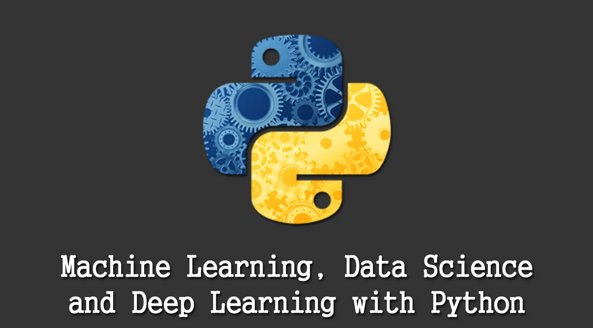

# 파이썬을 이용한 머신러닝과 딥러닝 기초다지기 

### Base of Machine Learning and Deep Learning Using Python 

 성균관대학교 하계 도전학기(2020)

### 1주차 

    1. 인공지능과 머신러닝
    1. 머신러닝 알고리즘
    3. 머신러닝의 예
    4. 머신러닝의 구성요소
    5. Scikit-learn 소개
    6. XOR 연산 학습 1

### 2주차 

    7. XOR 연산 학습 2
    8. XOR 연산 학습 3
    9. scipy 1
    10. scipy 2
    11. matplotlib
    12. scikit-learn의 데이터셋 소

### 3주차 

    13. train데이터와 test 데이터 분리하기
    14. 붓꽃 품종 분류기 1
    15. 붓꽃 품종 분류기 2
    16. 붓꽃 품종 분류기 3

### 4주차

    17. 붓꽃 품종 분류기 4
    18. SVM 알고리즘 1
    19. SVM 알고리즘 2
